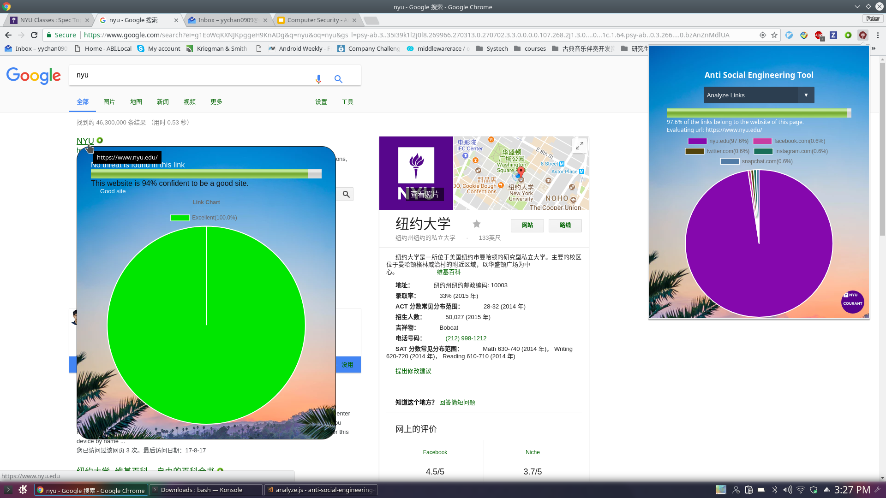
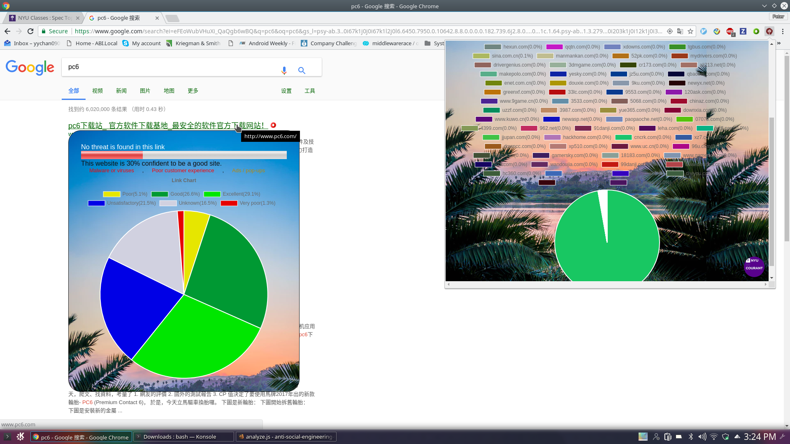
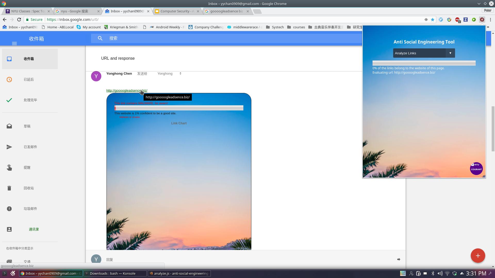

# Anti Social Engineering Tool
A chrome extension that helps users to avoid tricks in social engineering. With this extension, users could easily apply the suggested anti social engineering policies and protect themselves. To be specific, this extension tells you in English if the site is bad or not. If you have a bit more experience, it will also shows what percentage of links go where.

## Introduction
This a chrome extenstion that provides functionalities to analyze sites when hovering on them.

### Steps to Use
* By clicking on an extension icon at the top-right corner, a popup is displayed.
* Select "Analyze links" to analyze all links on the current website, then the analyzed links would be displayed in green.
* Now you are free to hover on any links in green and explore the site information of each link without visiting it.

### Graph Information
+ Right below the hovered link, a popup is displayed to indicate the site status.
    * It tells that no threat is discovered. This is retrieved from Google Safe Browsing API and it tells you whether this site is social engineering site or contains threats like malwares and unwanted software.
    * A reputation bar chart of this site is retrieved from Web Of Trust (WOT) API.
    * Tags or categories of this site are retrieved also from WOT API.
    * A pie chart is generated based on all the links inside the hovered site. For each link in the site, we call WOT API for its reputation and categorize as a reputation distribution chart (Excellent >= 80, Good >= 60, Unsatisfactory >= 40, Poor >= 20, Very Poor >= 0).

+ In the top-right corner, another popup is displayed to show a domain distribution pie chart of the hovered site, indicating how many links inside the hovered site belongs to the same domain, and what those domains are.

## Example of Good-reputation Website
Here is an example of good site, which is official website of New York University.

## Example of Low-reputation Website
Here is a screenshot of our extension when hovering on a website with low reputation.

## Example of Malware Website
When a threat is discovered, Google Safe Browsing API would indicate what it is.

